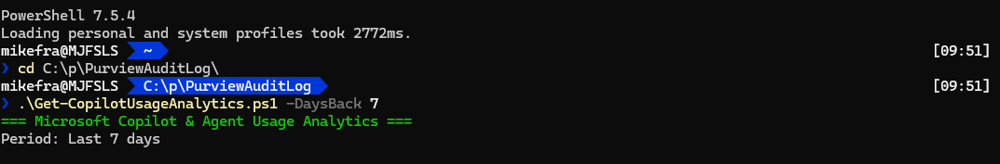
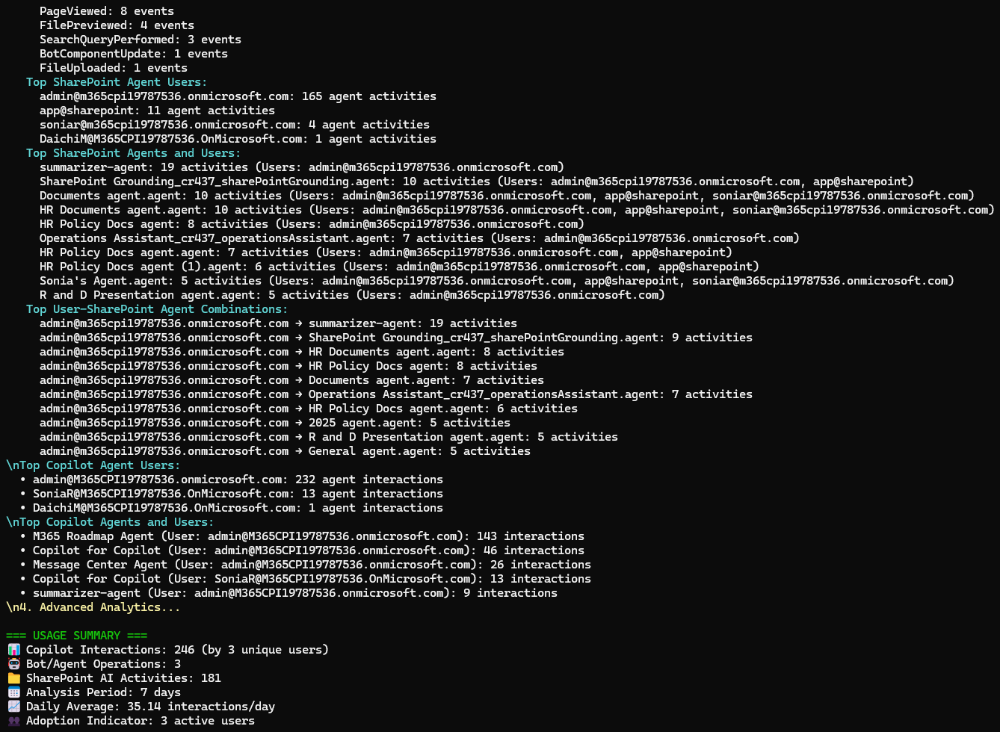

<!-- Create Readme for .\Get-CopilotUsageAnalytics .ps1 explaining analytics presented. -->
# Copilot Agent Usage Analytics 
This PowerShell script retrieves and analyzes Copilot agent usage data from including SharePoint agents using the Microsoft Graph API. It generates a report that provides insights into how Copilot is being used within your organization. Detains are provide in csv format for further analysis.
<!-- provide details on analytics presented -->
## Features
- Retrieves Copilot interaction logs from SharePoint Online.
- Analyzes bot/agent development activities.
- Tracks SharePoint agent activities.
- Generates a comprehensive report summarizing Copilot usage patterns.
- Customizable parameters for analysis period and output format.
- Supports exporting data to CSV for further analysis.
- Handles authentication and permissions for accessing Microsoft Graph API.
- Includes user activity metrics related to Copilot interactions.
- Provides insights into the types of operations performed using Copilot.
- Supports filtering data by user, date range, and operation type.
<!-- provide details technology  used. For example if graph API, PowerShell modules, etc. -->

## Example Output
  
  
  
  


## Microsoft Graph APIs Used
See [SCRIPT_DETAILS.MD](./SCRIPT_DETAILS.MD) for detailed information on the specific Microsoft Graph APIs and endpoints utilized in this script.

## Prerequisites    
- PowerShell 5.1 or later
- Microsoft Graph PowerShell SDK installed. You can install it using the following command:
  ```powershell
  Install-Module Microsoft.Graph -Scope CurrentUser
  ```
- Appropriate permissions to access SharePoint Online and Microsoft Graph API.
## Required Roles
To successfully run this script, the minimum required permissions include:
- [View-Only Audit Logs](https://learn.microsoft.com/en-us/exchange/view-only-audit-logs-role-exchange-2013-help) role assignment  

## Usage
- Run the script in a PowerShell session with the necessary permissions.
- The script will connect to SharePoint Online and Microsoft Graph API to gather Copilot usage data.
- It will generate a report summarizing Copilot interactions, bot/agent development activities, and SharePoint agent activities.
- Use the provided parameters to customize the analysis period and output options.  
- Example commands to run the script:  
```powershell
# Standard usage with default 7-day windows
.\Get-CopilotUsageAnalytics.ps1 -DaysBack 90 -ExportAll

# Smaller windows for high-volume environments
.\Get-CopilotUsageAnalytics.ps1 -DaysBack 180 -WindowDays 3 -Verbose

# Larger windows for lighter data
.\Get-CopilotUsageAnalytics.ps1 -DaysBack 60 -WindowDays 14 -DetailedAnalysis
```

Note: Adjust the `-DaysBack` parameter to specify the number of days for which you want to analyze Copilot usage. The `-ExportAll` switch exports all data to CSV files.  

Note: You will be prompted to authenticate when connecting to Microsoft Graph API. Ensure you have the necessary permissions to access the required data. If you don't see the authentication prompt, it may be behind the active PowerShell window.

## Output
- The above command retrieves Copilot usage data for the past 7 days and exports all data to two CSV files. 

  - **CopilotInteractions-*.CSV**  This file contains detailed logs of all Copilot interactions within the specified period.
  - **CopilotUsageReport-*.CSV**  This file provides a summarized report of Copilot usage analytics, including metrics such as the number of interactions, types of operations performed, and user activity.

- The report includes metrics such as the number of Copilot interactions, types of operations performed, and user activity.

## Support  
For any issues or questions regarding the script, please open an issue in the repository or contact the maintainer.
